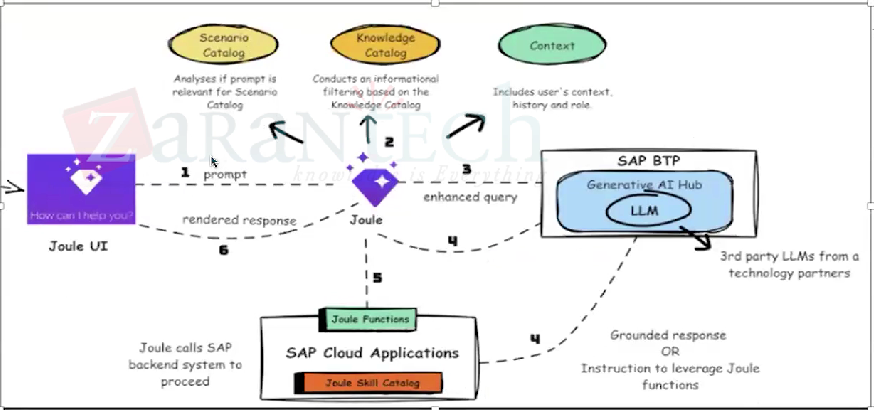

# ✈️ How Joule Works

1. User enters prompt
2. Request will be processed and orchestrated
3. Joule sends an enhanced query to LLM
4. LLM will work and respond back to Joule
5. Joule calls the functions for backend functions
6. Deliver response to the user

* Joule UI ⇒ Joule ⇒ Joule will check the catalog&#x20;
* Scenario ⇒ Check if its for payroll, HR etc. — Analyze if prompt is relevant for scenario catalog
* Knowledge Catalog ⇒ Conducts an informational filtering based on the knowledge catalog
* Context ⇒ Includes users context history and role
* This enhanced query will be send to LLM using GenAI Hub
* It will send grounded response OR Instruction to leverage Joule functions
* Joule calls SAP backend system to proceed
*

    <figure><figcaption></figcaption></figure>
