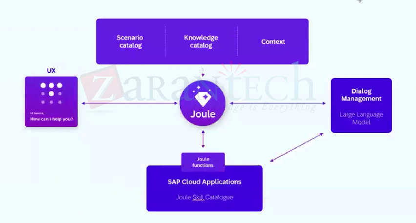

# Joule Architecture

* Enriches users query with context before passing it to LLM
* These LLM comes from partners with strict agreement ensuring no customer data is used for modelling
* LLM returns a grounded response or identifies the need to trigger SAP cloud application scenarios&#x20;
* Joule then interacts with SAP backend as needed
* All responses are filtered and returned securely - ensuring data privacy, security and responsible AI
*

    <figure><figcaption></figcaption></figure>
