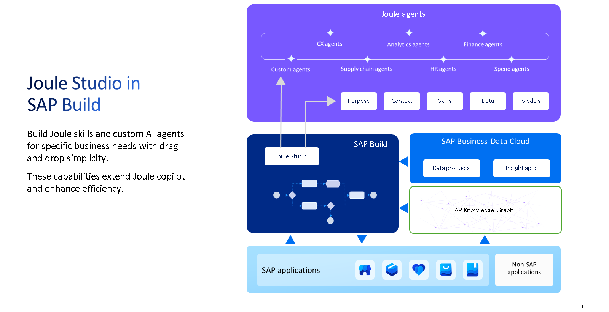

# Tutorial: Create Action Projects

* Actions are used in SAP Build Process Automation to connect processes with external systems, be it SAP or non-SAP systems, and to make GET, POST, PATCH and other calls.&#x20;
* Actions created here can be consumed directly in a Joule skill created in Joule Studio.

**Step 1: Create action project for BusinessPartner service**

* Build Lobby ⇒ Connectors ⇒ Action ⇒ API Source ⇒ OData Destinations
* Select the destination which we had created
* Enter a project name and description
* All the methods under the selected odata will be listed
* Selected the ones which are needed
* Select the output fields which are required
* Select test ⇒ Enter the input and check if data is fetched correctly
*   Save ⇒ Release ⇒ Publish

    <figure><figcaption></figcaption></figure>
*
