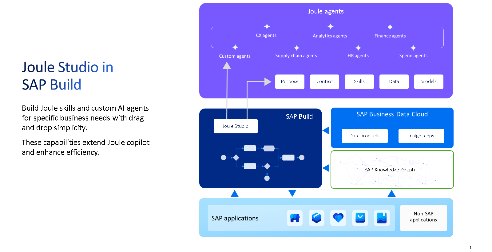

# What is Joule Studio

* Allows to create Joule skills and agents with simple drag and drop

**AI Agents:**&#x20;

* Tackle complex, goal-oriented business scenarios that require dynamic planning and reasoning (e.g., talent acquisition, predictive maintenance, fraud detection)
* Multi-step reasoning that can plan, reflect and choose their own tools.
* Planning, acting, and adapting until the goal is met

**Joule Skills:**&#x20;

* Handle simpler, rule-based tasks within business processes.

**Features:**

* AI Agent Builder
* Develop rule based Joule skills
* Low code tool
* Connect with SAP and third party applications
* Built-in security, compliance, and data privacy controls.

<figure><figcaption></figcaption></figure>

